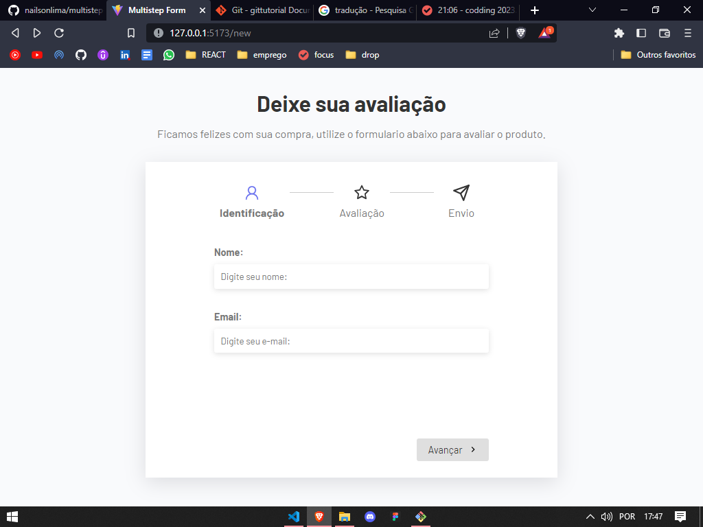
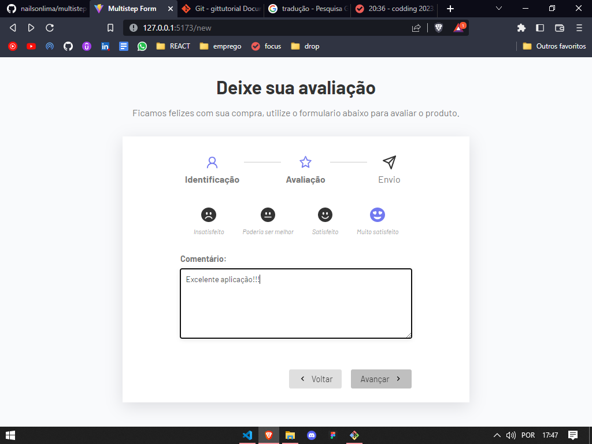
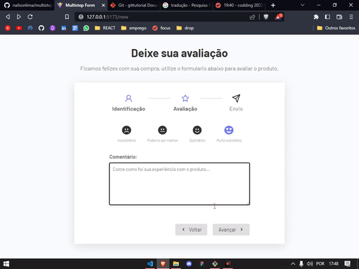

# 👥FORMULARIO COM MULTIPLA ETAPA👥

## Sobre🔍

Projeto desenvolvido com ReactJS

<h2>Salvo que temos implementado um sistema de requisição de dados, e também uma logica para a permanencia dos mesmos!</h2>

## DEMONSTRAÇÃO✔

Abaixo temos as telas do projeto, não temos todas aqui

<h2>
Para ter acesso ao projeto, execute a seguinte sequencia de comando:
</h2>

